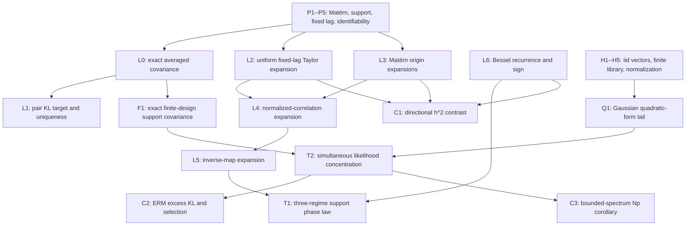

# Theorem--lemma--proof dependency map

## Current mathematical scope

The paper studies a univariate stationary Matérn Gaussian field observed after a
known deterministic local averaging operation. Its primary analytic object is a
fixed, nonzero-lag, normalized two-point Gaussian likelihood with known Matérn
smoothness and unknown variance and inverse range. The paper does **not** claim a
phase law for unrestricted full-grid maximum likelihood.

A separate finite-sample proposition treats (N) independent
(p)-dimensional Gaussian spatial vectors and a deterministic finite covariance
library. Dependence among the (p) coordinates is unrestricted. This is
high-dimensional structured model selection, not unstructured covariance
estimation.

## Canonical continuous-support model

Let

\[
  C(r)=v\mathcal M_\nu(\alpha\lVert r\rVert),\qquad
  \mathcal M_\nu(x)=\frac{2^{1-\nu}}{\Gamma(\nu)}x^\nu K_\nu(x),
\]

and let (k) be a compactly supported symmetric probability density. For
independent (U,V\sim k), set (D=U-V),
(Sigma_k=\mathbb E(UU^\top)), and (T_k=\operatorname{tr}(Sigma_k)). The
locally averaged field

\[
  Z_h(t)=\int h^{-d}k(u/h)Y(t-u)\,du
\]

has covariance

\[
  C_h(r)=v\mathbb E\mathcal M_\nu
  \{\alpha\lVert r+hD\rVert\}.
\]

At a fixed lag (r=Re), (R>0), the exact point-support pairwise KL target is

\[
  v_h^\dagger=C_h(0),\qquad
  \mathcal M_\nu(\alpha_h^\dagger R)
  =\rho_h(r):=C_h(r)/C_h(0).
\]

## Assumptions used by the phase theorem

**P1 (field).** The latent field is mean-zero, stationary, Gaussian, and has the
declared Matérn covariance convention. Gaussianity is needed for the likelihood
interpretation, but the covariance expansion itself uses only second moments.

**P2 (kernel).** The averaging density is nonnegative, symmetric, integrates to
one, is supported on (B(0,L)), and is nondegenerate
((T_k>0)). Compactness supplies uniform Taylor remainders and all required
moments.

**P3 (lag).** (R) lies in a compact annulus bounded away from zero and
(h\le R/(4L)). The theorem does not cover a lag (R=O(h)).

**P4 (parameters).** Smoothness is fixed and positive. Decay lies in a compact
subset of ((0,\infty)). Remainders are not uniform as (\nu) approaches the
transition values one or two.

**P5 (pair target).** Smoothness is known; pair variance and inverse range are
free. Strict monotonicity of (\mathcal M_\nu) identifies the decay target once
(0<\rho_h(r)<1).

## Assumptions used by the high-dimensional proposition

**H1 (replicates).** (X_1,\ldots,X_N\) are genuinely independent and each has
law (N_p(0,\Sigma_0)). Spatial coordinates within a vector may be arbitrarily
dependent.

**H2 (library).** The (M) candidate covariances are deterministic, or are
constructed independently of the (X_i), and all covariances are strictly
positive definite. A grid tuned on the same samples is not covered.

**H3 (normalization).** The likelihood contains the conventional factor
(1/2) and is averaged over both (N) and (p).

**H4 (high-dimensional corollary only).** Uniform relative spectral control is
assumed when replacing candidate-specific matrix norms by an
(O\{\sqrt{\log(M)/(Np)}\}) rate. It is not inferred from stationarity.

**H5 (parameter conclusions only).** A separation or margin condition is an
additional identifiability assumption. Likelihood concentration alone does not
prove separate Matérn variance and range consistency, especially under
fixed-domain infill.

## Dependency graph

## Statements and proof status

### L0. Exact averaged covariance -- complete, classical

Fubini's theorem and stationarity give

\[
  C_h(r)=v\mathbb E\mathcal M_\nu
  \{\alpha\lVert r+hD\rVert\}.
\]

For a finite deterministic observation matrix (S_h), the exact covariance is
(S_hKS_h^\top). This identity is cited as standard and is not claimed as
novel.

### L1. Pairwise KL target -- complete

The smoothed two-by-two covariance belongs to the naive two-parameter pair
family. Positivity of the smoothed spectral density gives
(0<\rho_h(r)<1), and

\[
  \mathcal M_\nu'(x)
  =-\frac{2^{1-\nu}}{\Gamma(\nu)}x^\nu K_{\nu-1}(x)<0
\]

gives uniqueness.

### L2. Fixed nonzero-lag expansion -- complete

For (f_\alpha(x)=\mathcal M_\nu(\alpha\lVert x\rVert)), a fourth-order Taylor
expansion is uniform on the declared annulus. Kernel symmetry removes odd
expectations and yields

\[
  C_h(r)/v
  =\mathcal M_\nu(\alpha R)+h^2B_{\nu,k}(r)+O(h^4).
\]

The proof requires (R) bounded away from zero. Applying it at the origin would
be incorrect for rough Matérn fields.

### L3. Origin expansions -- complete

The Bessel series at zero, integrated against bounded (D), yields

\[
  1-C_h(0)/v
  \asymp
  \begin{cases}
  h^{2\nu}, & 0<\nu<1,\\
  h^2\log(1/h), & \nu=1,\\
  h^2, & \nu>1.
  \end{cases}
\]

The explicit constants and the separate remainder transition at (\nu=2) are
recorded in the manuscript. Dominated termwise expectation is justified by
compact support; a formal, unbounded spectral Taylor expansion is not used.

### L4--L5. Normalization and inverse map -- complete

Divide the fixed-lag expansion by the appropriate origin expansion. Then apply
the local inverse of
(alpha\mapsto\mathcal M_\nu(\alpha R)). The derivative is nonzero at every
positive fixed lag. These steps produce the exact leading coefficients for the
inverse-range displacement.

### L6. Smooth-regime sign -- complete

For (\nu>1), the Matérn differential equation and

\[
  K_\nu(z)=K_{\nu-2}(z)+2(\nu-1)K_{\nu-1}(z)/z
\]

reduce the normalized-correlation coefficient to a positive multiple of
(K_{\nu-2}(z)). Since
(mathcal M_\nu'(z)<0), ignored support decreases inverse range and inflates
range for sufficiently small support.

### T1. Matérn support phase law -- complete, central contribution

For fixed (\nu>0),

\[
  \alpha-\alpha_h^\dagger
  \asymp
  \begin{cases}
  h^{2\nu}, & 0<\nu<1,\\
  h^2\log(1/h), & \nu=1,\\
  h^2, & \nu>1,
  \end{cases}
\]

with explicit positive coefficients. The theorem is a pairwise
pseudo-parameter statement, not a universal full-likelihood theorem.

### C1. Directional support contrast -- complete

For the transformed product smoother
(Z_{h,A}(t)=\int k(u)Y(t-hAu)\,du), let
(Sigma_A=AA^\top/5). For unit directions (e_1,e_2),

\[
  \{\alpha-\alpha_h^\dagger(e_1)\}
  -\{\alpha-\alpha_h^\dagger(e_2)\}
  =\frac{\alpha^2\{e_1^\top\Sigma_Ae_1-e_2^\top\Sigma_Ae_2\}}R
  \frac{K_{\nu-2}(\alpha R)}{K_{\nu-1}(\alpha R)}h^2+o(h^2).
\]

For (\nu\le1), this contrast is lower order than the common leading shift.
The qualitative fact that convolution can look anisotropic is known; the paper
claims only the explicit apparent-range coefficient.

### F1. Finite-design support-aware containment -- complete

If the true covariance is
(\Sigma_0=S_hK_{\theta_0}S_h^\top), then the support-aware candidate at
(\theta_0) equals the truth. The naive point-support family generally does
not contain it. Boundary-normalized finite rows are treated exactly in the
generator; no interior translation-invariance claim is made for them.

### Q1--T2. Finite-library likelihood concentration -- complete, standard tool

For

\[
  \widehat L_N(\theta)=\frac1{2p}
  \{\log\det\Sigma_\theta+
  \operatorname{tr}(\Sigma_\theta^{-1}\widehat\Sigma_N)\},
  \qquad
  A_\theta=\Sigma_0^{1/2}\Sigma_\theta^{-1}\Sigma_0^{1/2},
\]

the Laurent--Massart Gaussian quadratic-form inequality and a union bound imply
that, with (t=\log(2M/\delta)), simultaneously over the library,

\[
  |\widehat L_N(\theta)-L(\theta)|
  \le
  \frac{\lVert A_\theta\rVert_F}{p}\sqrt{\frac tN}
  +\frac{\lVert A_\theta\rVert_{\rm op}}p\frac tN
\]

with probability at least (1-\delta). All constants have been checked against
the likelihood's (1/(2p)) normalization.

### C2. ERM and KL consequences -- complete

An exact empirical minimizer has population excess risk at most twice the
maximum simultaneous radius. Because population risk differs from forward
Gaussian KL divergence only by a candidate-independent constant, this gives a
finite-sample KL-oracle inequality. Exact library selection additionally
requires population separation; parameter error requires a margin.

### C3. (Np) scaling -- conditional and stated as such

If

\[
  c\Sigma_0\preceq\Sigma_\theta\preceq C\Sigma_0
\]

uniformly over the library, then the radius is at most

\[
  c^{-1}\left\{
  \sqrt{\frac{\log(2M/\delta)}{Np}}
  +\frac{\log(2M/\delta)}{Np}
  \right\}.
\]

The benchmark reports the actual relative operator and Frobenius norms rather
than assuming they remain bounded.

## Explicit nonclaims and stop conditions

- No theorem asserts a phase law for arbitrary full-grid maximum likelihood.
- No independent-pair likelihood is substituted for overlapping spatial pairs.
- No (Np) rate is claimed for correlated replicates.
- No finite-grid union bound is applied to a candidate set learned from the same
  data.
- No separate fixed-domain consistency claim is made for Matérn variance and
  range.
- No adaptive diagonal jitter is permitted in theorem-facing experiments.
- If the directional or phase coefficient fails its quadrature refinement gate,
  the corresponding claim is removed rather than explained away post hoc.
