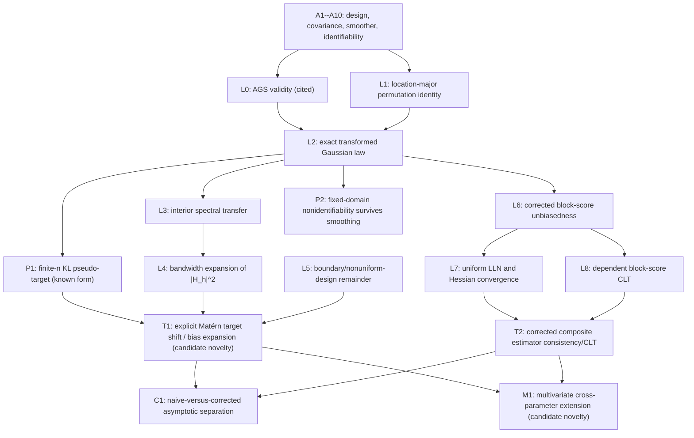

# Theorem--lemma--proof dependency map

## Scope

The proposed theory is fixed-\(p\) inference for a Matérn field observed after a
known deterministic local smoother. It is not growing-dimensional theory. Results
labelled **known** must be cited rather than claimed; results labelled **candidate
novelty** must be proved before a paper is viable.

## Canonical setup

Let \(D_n\uparrow\mathbb R^d\), let \(s_{1,n},\ldots,s_{n,n}\in D_n\), and define

\[
y_n=z_n+\varepsilon_n,
\quad
z_n\sim N(0,K_{\theta_0,n}),
\quad
\varepsilon_n\sim N(0,\tau_0^2I).
\]

A deterministic spatial smoother \(S_{n,h}\) gives

\[
\widetilde y_n=S_{n,h}y_n,
\qquad
\Sigma_{0,n,h}
=S_{n,h}(K_{\theta_0,n}+\tau_0^2I)S_{n,h}^\top.
\]

For \(p>1\), replace \(S_{n,h}\) by \(A_{n,h}=S_{n,h}\otimes I_p\) under
location-major stacking. The naive model treats \(\widetilde y_n\) as point data
with covariance \(\Sigma_{\phi,n}^{\rm naive}\). The corrected model uses
\(A_{n,h}K_{\theta,n}A_{n,h}^\top\), including transformed nugget
\(\tau^2A_{n,h}A_{n,h}^\top\).

## Assumptions

**A1 (design).** Increasing domains have \(|D_n|\asymp n\), minimum location
separation bounded below, sampling density bounded above and below, and boundary
volume \(|\partial_hD_n|/|D_n|\to0\).

**A2 (parameter space).** \(\Theta\) is compact, \(\theta_0\) is interior, decay
scales, smoothnesses, variances, and nugget are bounded away from zero and infinity.

**A3 (valid covariance).** The exact AGS scale convention and a globally valid,
identified multivariate parameterization are used. A finite-design Cholesky check
is not a substitute.

**A4 (spectral regularity).** The univariate spectral density or multivariate
spectral matrix and required derivatives are continuous, integrably dominated,
and uniformly bounded above and away from singularity after observation noise.

**A5 (smoother).** \(S_{n,h}\) depends on locations, not responses; rows have
bounded support/\(\ell_1\)-norm; interior rows converge to a translation-invariant
kernel with transfer function \(H_h(\omega)\). Boundary normalization is explicit.

**A6 (identifiability).** The corrected population objective has unique minimizer
\(\theta_0\). The naive objective has a locally unique pseudo-target \(\phi^*(h)\)
with nonsingular Hessian.

**A7 (dependence).** The field is strongly mixing at a rate sufficient for a
uniform law of large numbers and score CLT over local blocks. For Gaussian fields,
derive the rate from covariance decay rather than merely assuming independence.

**A8 (blocks).** Block diameters and gaps are declared; overlap degree is bounded;
the effective number \(B_n\to\infty\). Whole-grid, heavily overlapping resolutions
in the original repository do not meet this condition.

**A9 (moments and derivatives).** Scores have a uniformly bounded \(2+\delta\)
moment and objective derivatives through order three are dominated in a
neighborhood of the target.

**A10 (fixed domain).** Any infill theorem fixes \(\nu\) or explicitly states the
identifiable microergodic parameter; it does not claim separate consistency of
variance and decay.

## Dependency graph

## Proposed statements and proof obligations

### L0. Valid multivariate Matérn covariance -- known

State the AGS theorem exactly. Verify that the implementation uses
\(M(h\mid\nu,\alpha)\propto(\alpha\lVert h\rVert)^\nu
K_\nu(\alpha\lVert h\rVert)\), that \(R_A,R_B,R_V\) satisfy their matrix
constraints, and that diagonal equations are not overwritten after construction.
No novelty is claimed.

### L1. Stacking/permutation identity -- routine

If \(K_{ab,ij}=\operatorname{Cov}\{Y_a(s_i),Y_b(s_j)\}\), then

\[
K^{\rm loc}_{(i,a),(j,b)}=K_{ab,ij}
\]

and \(K^{\rm loc}=P K^{\rm var}P^\top\) for an explicit perfect-shuffle
permutation \(P\). This statement anchors every simulation and likelihood test.

### L2. Exact transformed Gaussian law -- known/routine

For deterministic \(A\),

\[
y\sim N(\mu,K)\quad\Longrightarrow\quad
Ay\sim N(A\mu,AKA^\top).
\]

For two smoothers, \(\operatorname{Cov}(A_gy,A_hy)=A_gKA_h^\top\). If noise
occurs before smoothing, its covariance is \(\tau^2AA^\top\), not \(\tau^2I\).

### L3. Interior spectral transfer -- known/routine

For a translation-invariant smoother with transfer function \(H_h\), show

\[
f_{0,h}(\omega)=|H_h(\omega)|^2
\{f_{\theta_0}(\omega)+f_\varepsilon(\omega)\}.
\]

For multivariate fields, the scalar multiplier becomes
\(|H_h|^2F_{\theta_0}\) when all components use the same smoother, or
\(H_hF_{\theta_0}H_h^*\) for component-specific filters.

### P1. Naive KL pseudo-target -- known framework

The finite-\(n\) population Gaussian criterion is

\[
Q_{n,h}(\phi)
=\log\det\Sigma_{\phi,n}^{\rm naive}
+\operatorname{tr}\{(\Sigma_{\phi,n}^{\rm naive})^{-1}
\Sigma_{0,n,h}\}.
\]

Its minimizer is the pseudo-target. The expected-score formula follows by matrix
calculus. Cite misspecified GP asymptotics; do not claim this characterization as
new.

### L4. Small-bandwidth filter expansion -- technical

For a symmetric order-\(q\) kernel, establish uniformly on the integrable spectral
region

\[
|H_h(\omega)|^2
=1-h^q b(\omega)+r_h(\omega),
\qquad
\int |r_h(\omega)|w(\omega)d\omega=o(h^q).
\]

The exponent depends on the smoother moments and on sampling/discretization. A
formal Taylor series without a dominating envelope is insufficient for Matérn
tails.

### L5. Boundary and irregular-design remainder -- technical

Show that the normalized objective/score difference between the actual
row-normalized smoother and its stationary interior surrogate is negligible at
the scale needed by T1 and T2. This requires a boundary-to-volume rate and bounded
row influence. If the application has a highly perforated tissue boundary, the
remainder may not vanish and must instead be modeled.

### T1. Matérn-specific target shift -- candidate novelty and first stop gate

Let \(G(\phi,h)=\nabla_\phi Q_h(\phi)\). If \(G(\theta_0,0)=0\) and
\(H_0=\partial_\phi G(\theta_0,0)\) is nonsingular, use the implicit-function
theorem to obtain

\[
\phi^*(h)-\theta_0
=-h^qH_0^{-1}g_q(\theta_0)+o(h^q).
\tag{T1}
\]

The publishable step is an explicit \(g_q\), a proof that a scientifically
relevant component is nonzero, and the direction/magnitude of the shift for a
Matérn family. Merely writing the implicit formula is not enough.

For one rigorous starting example, let
\(C(r)=\sigma_0^2e^{-\alpha_0|r|}\) and use the continuous Epanechnikov kernel.
If \(U,V\) are independent Epanechnikov draws, then
\(\mathbb E|U-V|=18/35\), hence

\[
\operatorname{Var}\{Z_h(s)\}
=\sigma_0^2\left[1-\frac{18}{35}\alpha_0h+O(h^2)\right].
\]

With known \(\alpha_0\), the naive one-point variance target has exactly this
first-order bias. This is a counterexample to unbiased naive fitting, but a paper
must go beyond the one-point variance calculation to the joint likelihood target.

### L6. Correct composite-score unbiasedness -- routine but essential

For every local block \(b\), use its exact transformed marginal covariance and
show

\[
\mathbb E_{\theta_0}\nabla\ell_b(\theta_0)=0.
\]

If several smoothing resolutions share observations, either stack them with their
joint cross-covariance or use a declared composite objective and retain cross-term
contributions in the variability matrix \(J\).

### L7--L8. Uniform LLN, Hessian limit, and score CLT -- standard machinery

Under A1--A9, prove normalized objective convergence, a unique population
minimizer, sensitivity limit \(H\), and score CLT with variability \(J\). Imported
mixing theorems must match the triangular array, block overlap, and parameter
uniformity; an independent-block theorem cannot be cited for overlapping grids.

### T2. Corrected composite M-estimator -- defensible but mainly standard

For fixed \(p\),

\[
\widehat\theta_n\overset p\longrightarrow\theta_0,
\qquad
\sqrt{B_n}(\widehat\theta_n-\theta_0)
\Rightarrow N(0,H^{-1}JH^{-1}).
\tag{T2}
\]

The theorem becomes interesting only if the smoothing/block design creates a new
rate, efficiency tradeoff, or estimator that is not a direct textbook M-estimator.

For fixed bandwidth and valid local blocks, T2 can remain centered while the naive
estimator converges to \(\theta^*(h)\ne\theta_0\). Under a mixed-domain design with
enough observations inside a shrinking bandwidth, if
\(\theta^*(h_n)-\theta_0=Bh_n^q+o(h_n^q)\), then the phase boundary is
\(\sqrt{B_n}h_n^q\): it vanishes, produces a shifted normal limit, or dominates
sampling error according as this quantity tends to 0, a finite nonzero constant,
or infinity. This corollary is not available under pure increasing domain with a
fixed minimum separation unless the design also has local infill.

### P2. Fixed-domain impossibility -- known consequence

If two latent Matérn Gaussian measures are equivalent under infill, their
pushforwards under any measurable deterministic smoother are also equivalent.
Smoothing therefore cannot recover separate variance and decay parameters that
were nonidentifiable before smoothing. State inference in terms of microergodic
combinations.

### M1. Multivariate extension -- possible second novelty layer

Replace scalar spectra by \(p\times p\) spectral matrices and derive the bias of
cross-correlation/cross-decay parameters. Prove identifiability after removing the
current equicorrelation and \(W_i\) confoundings. Fixed \(p\) is acceptable; do not
call this high-dimensional.

## Proof work plan and stop rules

1. **Week 1:** Prove T1 for exponential/Matérn-\(1/2\) covariance and one
   symmetric smoother on an infinite regular lattice or continuum surrogate.
2. **Week 2:** Generalize the differentiability/dominance step to a compact
   Matérn parameter set and compute \(g_q\).
3. **Week 3:** Establish boundary/discretization remainder L5 and reproduce the
   coefficient numerically.
4. **Week 4 gate:** stop Direction A if no explicit nonzero coefficient or strict
   displacement theorem survives exact calculation.
5. **Weeks 5--7:** prove T2 for a newly specified local-block objective; do not
   attempt to justify the current ten whole-grid batches.
6. **Weeks 8--10:** multivariate extension M1 and fixed-domain proposition P2.

Counterexamples, singular smoothers, failed domination arguments, and parameter
nonidentifiability must be recorded in `RESEARCH_LOG.md`, not silently removed.
